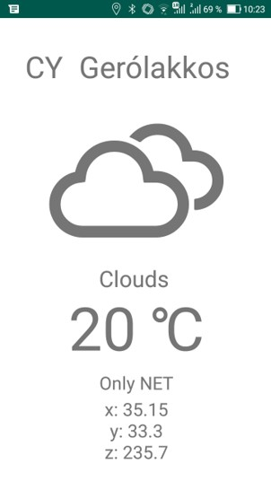
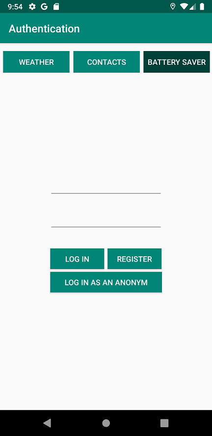
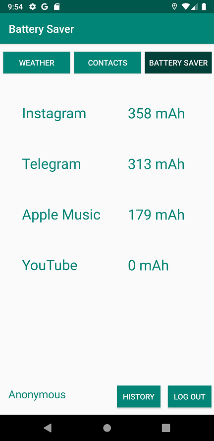
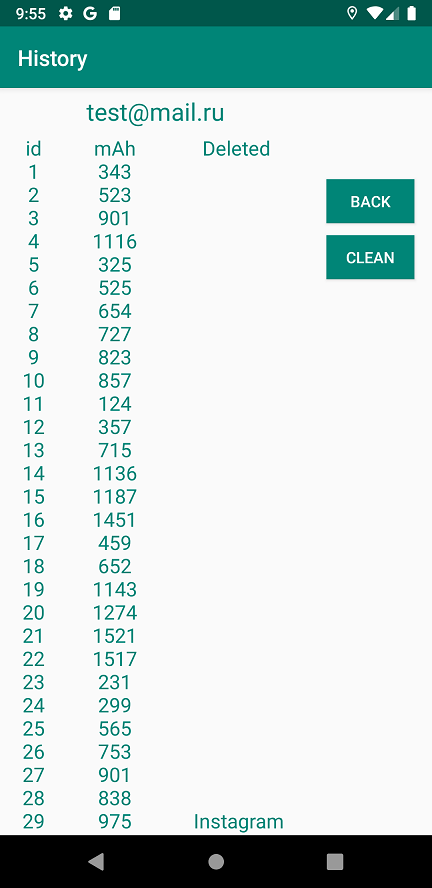

# Android_Java_App
An Android application written in Java for educational purposes.
Has functionality:

1 Determining the location and weather at this location using the OpenWeatner API.

2 Sending contacts (name, phone number and email) to the server. (I used my local server written on Flask)

3 Simulate applications battery consumption using threads. Temporary shutdown of the application that consumes the most energy for some units of time. 
Account registration is supported using Firebase, which allows you to save the history of consumption. The SQLite database is used to store history. 

  

